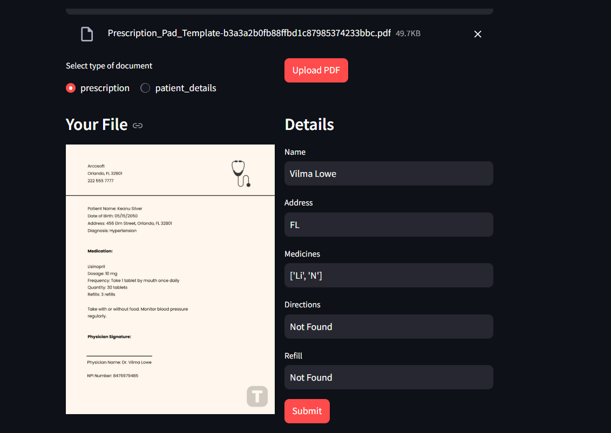

# IDP Medical Data Extractor

## Introduction

The IDP Medical Data Extractor is a web application designed to extract medical data from PDF files, specifically prescription documents and patient details forms. It utilizes Optical Character Recognition (OCR) technology powered by PaddleOCR for extracting text from scanned or image-based PDFs. The app processes the uploaded PDFs and extracts relevant details such as patient names, addresses, medicines, vaccination status, and more.

This app is built using **Streamlit** for the frontend, **FastAPI** for the backend, and **PaddleOCR** for text extraction from PDFs.

## Features
- Upload PDFs (either prescription or patient details).
- Extract patient information from the uploaded PDF document.
- Display extracted details on the web page.
- Submit extracted details for record-keeping.

## Prerequisites

Before running the app, make sure that the following software and dependencies are installed:

### Python Version
- Python 3.10

### Required Libraries

The app uses several Python libraries which need to be installed. You can install all dependencies via the `requirements.txt` file provided.

1. **NumPy Version:**
   - The application requires **NumPy 1.26.4**

2. **CUDA Installation:**
     ```bash
     pip3 install torch torchvision torchaudio
     ```


## Installation Steps

1. Clone this repository to your local machine:
   ```bash
   git clone https://github.com/dilukshashamal/Medical-Data-Extractor_Beta.git
   cd Medical-Data-Extractor_Beta
   ```

2. Run BackEnd
   ```bash
   cd backend
   uvicorn api_server:app --reload
   ```
3. Run FrontEnd
   ```bash
   cd frontend
   streamlit run app.py
   ```


   
   
